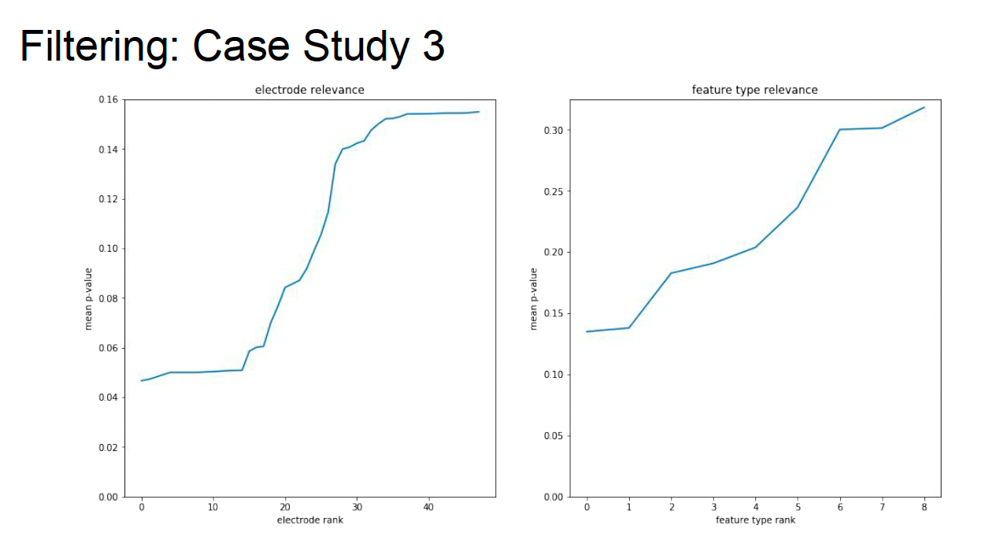
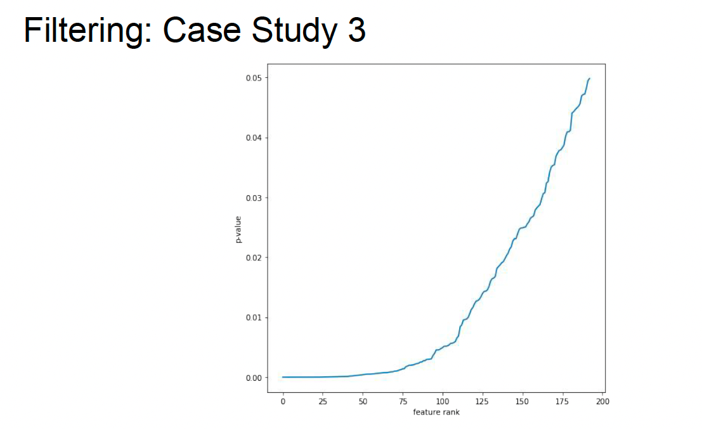
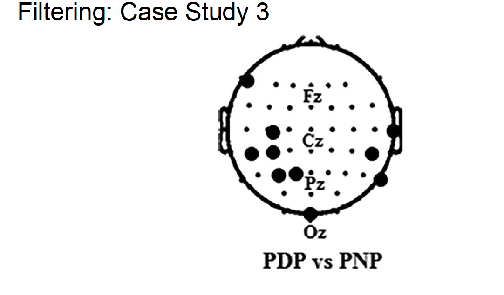

## 重要概念
- PNP negative -> 不会发作CNP
- PDP postive -> 会发作CNP
- Frequency Band Power 
- $\theta$ FBP 4-8HZ
- $\alpha$ FBP 4-8HZ
- $\beta$ FBP 4-8HZ

## 特征工程
特征工程是将原始数据转换成更好地代表预测模型学习问题的过程，从而提高模型对未见数据的泛化能力

Feature engineering is the process of transforming raw data into something that better represents the learning problem to the predictive model, resulting in improved generalization to unseen data.

* 对我们对数据领域和问题所拥有的先验知识进行编码
* 指导性问题
    - 哪些信息可以忽略？
    - 哪些信息应该保留？
    - 应该如何表示保留的信息？
* 这些问题的答案取决于
    - 数据领域
    - 待解决的问题
    - 预测模型
* 一些特征工程方法是特定于数据和问题领域的。

*	Encoding prior knowledge we have about the data domain and the problem
*	Guiding questions
	- Which information can be ignored?
	- Which information should be retained?
	- How should retained information be represented?
*	Answers to these questions depend on
	- Data domain
	- Problem to be solved
	- Predictive model
*	Some feature engineering methods are specific to the data and problem domains.

## 特征
特征是被观察现象的一个单独的可测量属性或特征

A feature is an individual measurable property or characteristic of a phenomenon being observed.

- 训练数据 Training data $\left \{ \left ( x_i,y_u \right )  \right \}_N $
- 特征 Features $\theta  \left ( x_i \right )$
- 模型 Model $f\left( \theta  \left ( x_i \right ),\theta  \right ) $
- 学习问题 Learning problem $argmin_\theta  L\left ( y_i, f\left ( \theta  \left ( x_i \right ),\theta   \right ) \right ) $

## 信息处理的取舍
高维空间难以处理。  
维数诅咒：在非常高维的空间中会发生奇怪的事情

* 固定数量的数据点占据的空间比例随着维数的增加而指数级减少。
* 随着维数的增加，体积靠近表面的部分所占比例增加。
* 点与点之间的距离变得越来越难以区分。

High-dimensional spaces are challenging to work with.
Curse of Dimensionality: strange things happen in very high-dimensional spaces

* A fixed number of datapoints occupy a fraction of the space that decreases exponentially with the number of dimensions.
* The portion of a volume near the surface increases in the number of dimensions.
* Distances between points become increasingly indistinguishable

## 特征选择
### 背景
每个数据点具有D个特征的数据集。
### 目标
在保留集上找到具有最小误差的M << D特征的子空间。

- 暴力求解子集评估在特征数量上是指数级的（NP难问题）
- 启发式方法
    - 筛选方法：使用替代量度并测试单个特征的相关性
    - 包装方法：贪婪地构建特征集并使用预测模型进行评估
    - 嵌入方法：预测模型在学习过程中选择特征（例如，LASSO）

### Context 
Dataset with D features per datapoint.
### Goal 
Find the subspace of M << D features with minimal error on hold-out set

-	Brute-force subset evaluation is exponential in the number of features (NP-hard problem)
-	Heuristics
    -	Filtering: use surrogate measure and test individual features’ relevance
    -	Wrappers: greedily build feature set and evaluate using predictive model
    -	Embedding: predictive model selects features during learning process (e.g., LASSO)

## 过滤方法
想法：
* 测量单个特征对因变量的相关性。
* 按相关性对特征进行排名。
* 保留前K个相关特征；k可以通过交叉验证来选择。

用作相关性评分的统计测试：
- 皮尔逊相关性
- 卡方测试
- 互信息
- t检验/方差分析

idea：
1.	Measure relevance of individual feature for dependent variable.
2.	Rank features by relevance
3.	Keep top K relevant features; k could be chosen via cross-validation

Statistical tests used as relevance scores:
- Pearson Correlation
- Chi-Square
- Mutual Information
- t-test / ANOVA

### 过滤方法 Filtering
 

如上图所示，左图表是“电极相关性”。图表展示了每个电极（EEG数据中的测量点）根据它们的相关性得分进行排名，得分用均值表示。这个得分可能是根据与目标变量的统计关联度（如皮尔逊相关性、卡方检验等）来量化的。图表的y轴表示相关性的均值，x轴表示电极的排名。从图表中可以看出，某些电极与目标变量的相关性更高，这意味着它们在预测模型中可能更为重要。

如上图所示，右图表标记为“特征类型相关性”。这个图表展示的是不同类型的特征按照相关性得分排名，这里的特征类型可能指的是从EEG数据中提取的不同的测量或计算出的值，比如功率谱密度、相位锁定值等。与第一张图表类似，y轴表示相关性的均值，x轴表示特征类型的排名。图表显示了某些特征类型比其他类型更相关。  

  

如上图所示，该图应该为180个特征根据评分机制的得分。

 

这幅图显示的是一个脑电图（EEG）电极布局的示意图，通常用于神经科学研究。图中的每个点代表头皮上放置的一个电极，这些电极用来记录脑电活动。电极的分布通常遵循国际10-20系统，这是EEG电极放置的标准方法。在这个系统中，电极位置以它们在头部的相对位置命名，例如：

- Fz：前额中线区域
- Cz：中央区域的顶点
- Pz：顶部后部区域
- Oz：枕骨区域的中心

"PDP vs PNP"是疼痛日程病人（PDP）和非疼痛日程病人（PNP）的EEG数据对比。这幅图可能是用来指出在这两种条件下，哪些特定的EEG特征（例如，从特定电极位置记录的信号）被用于进一步的分析或用于区分两种状态。
